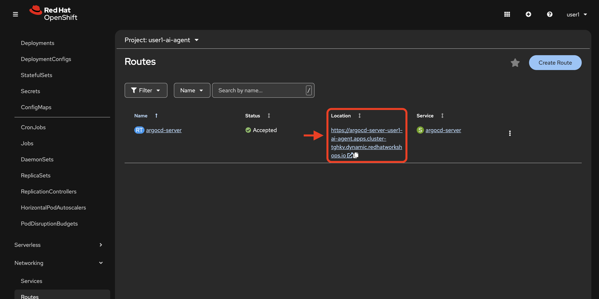

:imagesdir: ../assets/images
= From Playground to Prototype - Building Your Agent in OpenShift AI

include::vars.adoc[]

[NOTE]
====
Persona: AI Engineer (primary). Also relevant: Data Scientist.
====

[IMPORTANT]
.In this lab
====
You will open an OpenShift AI Workbench, carry over decisions and artifacts from the Llama Stack Playground work in xref:module-04.adoc[the previous module], then iteratively step through `notebooks/agent-prototyping.ipynb` to codify a working agentic flow. The lab ends by creating a GitHub issue in your repository from the agent’s final output. The following lesson will take this prototype to production.
====

== Prerequisites

[TIP]
====
Have these ready from your Playground session:

* Chosen model and endpoint (Llama Stack or MaaS)
* The refined system prompt and example user prompts
* Any tool choices (e.g., web search/Tavily) and API keys
* Parameters you validated
====

.Security reminders
* Keep PAT scopes minimal; store tokens securely
* Do not commit secrets or tokens to notebooks or repo; use pre-commit hooks to check for secrets
* Prefer Vault-managed secrets where possible

== Git clone repository locally

In your own environment, or in a workbench image terminal if preferred:

. Authenticate to the cluster with your user credentials.
. Clone your previously created repository fork:
+
[source,bash,options="wrap",role="execute"]
----
cd ${DESIRED_DIRECTORY_LOCATION}
git clone https://github.com/[YOUR-GITHUB-ID]/etx-agentic-ai-gitops.git
cd etx-agentic-ai-gitops
----
+
. Authenticate to github, if not already, using a personal access token (separate from the one previously created in the workshop) with at least `Read and Write` permission to `Contents` of the above repository.

== Load the Agent file

. In your local preferred environment, or within the workbench image IDE, open `agent/code/agent.py`.
// changes to file including your github user id, username

. Git commit and push changes to your fork.

== Trigger pipeline to build the agent image

. In your chosen terminal environment, create a PipelineRun using the following command:

NOTE: Ensure to replace the values in brackets with the actual values of your user number and forked repository location.

[source,bash,options="wrap",role="execute"]
----
oc -n user[YOUR_USER_NUMBER]-ai-agent create -f - <<'EOF'
apiVersion: tekton.dev/v1
kind: PipelineRun
metadata:
  generateName: agent-service-build-run-
  namespace: user[YOUR_USER_NUMBER]-ai-agent
spec:
  taskRunTemplate:
    serviceAccountName: pipeline
  pipelineRef:
    name: agent-service-build
  params:
    - name: GIT_REPO
      value: "https://github.com/[YOUR_FORK_LOCATION]"
    - name: GIT_REVISION
      value: "main"
  workspaces:
    - name: workspace
      volumeClaimTemplate:
        spec:
          accessModes:
            - ReadWriteOnce
          resources:
            requests:
              storage: 1Gi
EOF
----

. View the pipelinerun status either in the UI or by command:
+
[source,bash,options="wrap",role="execute"]
----
# List all PipelineRuns to find the generated name
oc -n user[YOUR_USER_NUMBER]-ai-agent get pipelineruns
# Watch the PipelineRun status
oc -n user[YOUR_USER_NUMBER]-ai-agent get pipelineruns -w
----

== Deploy the agent with ArgoCD

. In your chosen terminal, with your preferred editor, edit the `values.yaml` file found in `etx-agentic-ai-gitops/agent/chart/`

+
[source,bash,options="wrap",role="execute"]
----
vim etx-agentic-ai-gitops/agent/chart/values.yaml
----
+

. Replace the values for [YOUR_USER_NUMBER] and [YOUR_GITHUB_USERNAME] as shown in the example below:

[source,yaml,options="wrap",role="execute"]
----
namespace: user1-ai-agent
registry: image-registry.openshift-image-registry.svc:5000
application_name: ai-agent

# Agent Configuration
agentConfig:
  clientTimeout: "600.0"
  llamaStackUrl: "http://user1-llama-stack-service.user1-llama-stack.svc.cluster.local:8321"
  maxInferIterations: "50"
  maxTokens: "5000"
  modelId: "granite-3-2-8b-instruct"
  temperature: "0.0"
  githubOwner: "github_user"
----

. Set environment variables for the ArgoCD Application (replace with your actual values):
+
[source,bash,options="wrap",role="execute"]
----
export USER_NUMBER="1"  # Replace with your user number
export GITHUB_REPO="FORK_LOCATION" #Replace with GH location of your forked repo
export NAMESPACE="user${USER_NUMBER}-ai-agent"
----
+
. Create a new argo application from your command line with the following command (you may choose to create the app via the UI as well if you prefer):
+
[source,bash,options="wrap",role="execute"]
----
oc apply -f - <<EOF
apiVersion: argoproj.io/v1alpha1
kind: Application
metadata:
  name: ai-agent
  namespace: ${NAMESPACE}
spec:
  project: default
  source:
    path: agent/chart
    repoURL: ${GITHUB_REPO}
    targetRevision: HEAD
  destination:
    server: https://kubernetes.default.svc
    namespace: ${NAMESPACE}
  syncPolicy:
    automated:
      prune: true
      selfHeal: true
EOF
----

=== Check on application with CLI or ArgoCD UI

[source,bash,options="wrap",role="execute"]
----
oc get apps -o wide
----

. Get route for user-scoped argo instance:

[source,bash,options="wrap",role="execute"]
----
oc get routes | grep argo
----

or in the UI:

. Verify health of app and associated agent pod running

== Test your agent's function with a demonstrative pipeline

We will now test the MCP and model integrations, which we've tested already via the playground, in the context of your new agent that we've just deployed.

The pipeline demo pipeline we've prepared builds a java app that fails to deploy successfuly, which triggers an agent call to open a github issue with your forked test repository.

=== Apply the pipeline resource

Using your terminal or the (+) button in the web console, apply the following pipeline resource with your user number substituted into the metadata/namespace placeholder:

[source,yaml,options="wrap",role="execute"]
----
apiVersion: tekton.dev/v1
kind: Pipeline
metadata:
  name: java-app-build
  namespace: user${YOUR_USER_NUMBER}-ai-agent
spec:
  params:
  - default: image-registry.openshift-image-registry.svc:5000
    name: IMAGE_REGISTRY
    type: string
  - default: https://github.com/nstrug/openshift-quickstarts.git
    name: GIT_REPO
    type: string
  - default: bad 
    name: GIT_REVISION
    type: string
  - default: undertow-servlet
    name: SUBDIRECTORY
    type: string
  - name: NAMESPACE
    type: string
  tasks:
  - name: fetch-repository
    retries: 2
    params:
    - name: URL
      value: $(params.GIT_REPO)
    - name: REVISION
      value: $(params.GIT_REVISION)
    - name: SUBDIRECTORY
      value: ""
    - name: DELETE_EXISTING
      value: "true"
    taskRef:
      params:
      - name: kind
        value: task
      - name: name
        value: git-clone
      - name: namespace
        value: openshift-pipelines
      resolver: cluster
    workspaces:
    - name: output
      workspace: shared-workspace
  - name: build
    retries: 2
    params:
    - name: IMAGE
      value: $(params.IMAGE_REGISTRY)/$(params.NAMESPACE)/$(params.SUBDIRECTORY)
    - name: TLS_VERIFY
      value: "false"
    - name: CONTEXT
      value: $(params.SUBDIRECTORY)
    runAfter:
    - fetch-repository
    taskRef:
      params:
      - name: kind
        value: task
      - name: name
        value: s2i-java
      - name: namespace
        value: $(params.NAMESPACE)
      resolver: cluster
    workspaces:
    - name: source
      workspace: shared-workspace
  finally:
  - name: trigger-agent
    params:
    - name: aggregateTaskStatus
      value: "$(tasks.status)"
    taskSpec:
      params:
      - name: aggregateTaskStatus
      steps: 
      - name: check-task-status
        image: registry.redhat.io/openshift4/ose-cli:latest
        script: |
          if [ "$(params.aggregateTaskStatus)" == "Failed" ]
          then
            set -Bx
            echo "Looks like your pipeline failed, let's find where you messed up!"
            failed_pod=$(oc get pods --field-selector="status.phase=Failed" --sort-by="status.startTime" | grep -v "trigger-agent" | grep "java-app-build" | tail -n 1 | awk '{print $1}')
            curl -i -H "Content-Type: application/json" -X POST -d "{\"namespace\":\"$(params.NAMESPACE)\",\"pod_name\":\"${failed_pod}\",\"container_name\":\"step-s2i-build\"}" http://ai-agent:8000/report-failure
          fi
  workspaces:
  - name: shared-workspace
----

=== Trigger the pipeline

Since the pipeline is configured to fail by default (using `GIT_REVISION: bad`), you can trigger it with minimal parameters. Only `NAMESPACE` is required since it has no default.

. Set your user number as an environment variable:
+
[source,bash,options="wrap",role="execute"]
----
export YOUR_USER_NUMBER="1"  # Replace 1 with your actual user number
----

. Create the PipelineRun:
+
[source,bash,options="wrap",role="execute"]
----
oc -n user${YOUR_USER_NUMBER}-ai-agent create -f - <<EOF
apiVersion: tekton.dev/v1
kind: PipelineRun
metadata:
  generateName: java-app-build-run-
  namespace: user${YOUR_USER_NUMBER}-ai-agent
spec:
  taskRunTemplate:
    serviceAccountName: pipeline
  pipelineRef:
    name: java-app-build
  params:
    - name: NAMESPACE
      value: user${YOUR_USER_NUMBER}-ai-agent
  workspaces:
    - name: shared-workspace
      volumeClaimTemplate:
        spec:
          accessModes:
            - ReadWriteOnce
          resources:
            requests:
              storage: 1Gi
EOF
----

. Monitor the PipelineRun:
+
[source,bash,options="wrap",role="execute"]
----
oc -n user${YOUR_USER_NUMBER}-ai-agent get pipelineruns -w
----
+

The pipeline will fail on the build step, which will trigger the `finally` step which calls the agent service to analyze the failure and create a GitHub issue.

. Confirm pipelinerun detailed failure:
+
[source,bash,options="wrap",role="execute"]
----
oc get taskrun -l tekton.dev/pipelineRun=java-app-build-run-{UNIQUE_ID}
----
+
. Verify in your forked repository that the issue was successfully generated.
